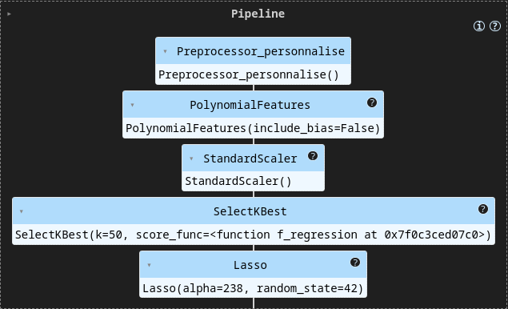

# 🏥 Projet Assur'Aimant - Prédiction des Primes d'Assurance USA


## 📋 Contexte du Projet

Assur'Aimant, un assureur français, souhaite s'implanter sur le marché américain et moderniser son processus d'estimation des primes d'assurance. Actuellement basé sur l'expertise des courtiers, le processus est chronophage et coûteux. Ce projet vise à automatiser et optimiser cette estimation grâce au machine learning.

### Objectifs
- 🎯 Automatiser l'estimation des primes d'assurance
- 📊 Analyser le profil des clients américains
- 💻 Fournir un outil interactif pour les estimations

## 📑 Table des Matières

1. [Analyse des Données](#-analyse-des-données)
2. [Modélisation](#-modélisation)
3. [Application](#-application)
4. [Installation](#-installation)
5. [Résultats](#-résultats)
6. [Gestion de Projet](#-gestion-de-projet)
7. [Équipe et Contact](#-équipe-et-contact)

## 📊 Analyse des Données

### Sources des Données
Données collectées auprès d'Assur'Aimant à Houston, comprenant :

| Variable | Description | Impact Business |
|----------|-------------|-----------------|
| BMI | Indice de masse corporelle (18.5-24.9 idéal) | Indicateur de risque santé |
| Sex | Genre du souscripteur | Facteur démographique |
| Age | Âge du bénéficiaire principal | Facteur de risque majeur |
| Children | Nombre d'enfants couverts | Impact sur la couverture |
| Smoker | Statut fumeur/non-fumeur | Facteur de risque critique |
| Region | Zone US (NE, SE, SO, NO) | Variation géographique |
| Charges | Prime d'assurance (Target) | Variable à prédire |

### Méthodologie d'Analyse
1. **Nettoyage des Données**
   - Détection des valeurs manquantes (missingno)
   - Identification des outliers
   - Validation de la qualité des données

2. **Analyse Exploratoire**
   - Distribution des variables
   - Corrélations avec les primes
   - Interactions entre variables

3. **Insights Clés**
   - Fort impact du statut fumeur sur les primes
   - Corrélation significative BMI-prime pour les fumeurs
   - Variations régionales modérées

## 🤖 Modélisation

### Pipeline de Traitement
1. **Préparation**
   - Split Train/Test (85/15)
   - Standardisation des variables
   - Encodage des catégories

2. **Modèles Testés**
   - Baseline (DummyRegressor pour comparaison)
   - Régression Lasso
   - Régression Ridge
   - ElasticNet

3. **Optimisation**
   - Utilisation de GridSearchCV pour ajuster les hyperparamètres
   - Validation croisée pour éviter le surapprentissage

### Feature Importance
Top 5 variables les plus influentes :
1. bmi smoker  (coef: 6843.404788)
2. age^2  (coef: 3416.503107)
3. smoker bmi_cat_obésité I  (coef: 2954.342833)
4. smoker bmi_cat_obésité II  (coef: 2491.658541)
5. smoker bmi_cat_obésité III  (coef: 1337.159042)

### Performances Finales

| Métrique | Valeur | Interprétation |
|----------|---------|----------------|
| R² | 0.926 | 92.6% de variance expliquée |
| RMSE | 3278.50 | Erreur moyenne de prédiction |
| MAE | 1990.90 | Écart absolu moyen |
| MSE | 10748554.85 | Erreur quadratique moyenne |
| MedAE | 1546.51 | Erreur médiane |

## 🔧 Architecture Technique

### Stack Technique
- **Preprocessing** : scikit-learn Pipelines
- **Modélisation** : Lasso Regression
- **API** : Streamlit
- **Déploiement** : Docker

### Pipeline de Production



## 💻 Application Streamlit

### Fonctionnalités
- Interface intuitive pour les courtiers
- Calcul automatique du BMI
- Prédiction instantanée des primes
- Visualisation des facteurs d'influence

### Installation et Utilisation

```bash
git clone git@github.com:Malek-Boumedine/brief_ML_assurances.git
cd brief_ML_assurances
python3 -m venv .venv
source .venv/bin/activate
pip install -r requirements.txt
streamlit run app.py
```

📅 Gestion de Projet
Planning

      Semaine 1 : Analyse et Modélisation
      Semaine 2 : Développement Application

Méthodologie

      Sprints hebdomadaires
      Daily meetings
      Code review systématique
      Utilisation de Trello pour la gestion des tâches

📈 Points Forts du Projet

      ✅ Précision élevée (R² > 0.92)
      🚀 Réduction significative du temps d'estimation
      📱 Interface utilisateur intuitive
      📊 Insights business actionnables

👥 Équipe et Contact

      Malek - Modélisation, Interface et Deploiement
      Dorothée - Modélisation, Analyse et Mise en forme

Support

Pour toute question ou assistance :

      📧 Email : contact@assuraimant.com
      🌐 Site : www.assuraimant.com

<p align="center"> Développé pour Assur'Aimant par l'équipe Data Science </p> 